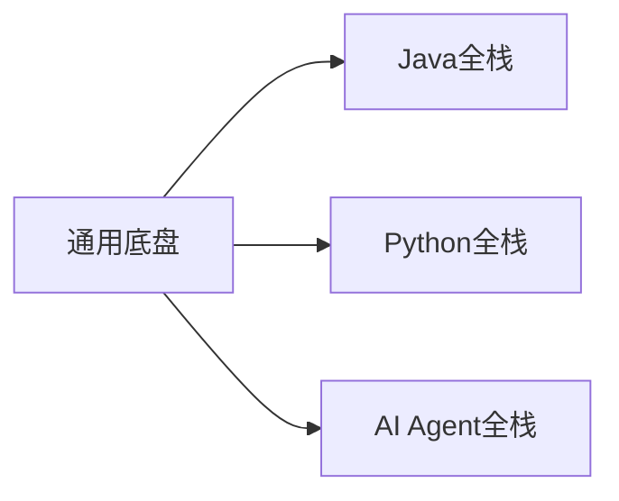

# 🎯 八股文面试篇 — 三大方向总览

> **目标**：同时备战 **Java全栈** | **Python全栈** | **AI Agent全栈** 三个方向的面试
> 核心策略：**打好基础底盘 → 纵向深入一个栈 → 横向拓展 AI Agent**

---

## 📂 目录结构

| 文件                      | 方向                | 覆盖范围                            |
| ----------------------- | ----------------- | ------------------------------- |
| [[八股文面试篇/Java全栈面试篇]]    | ☕ **Java全栈**      | Java基础、JVM、并发、SpringCloud、微服务架构 |
| [[八股文面试篇/Python全栈面试篇]]  | 🐍 **Python全栈**   | Python基础、FastAPI、Django、爬虫、数据分析 |
| [[八股文面试篇/AIAgent全栈面试篇]] | 🤖 **AI Agent全栈** | LLM原理、RAG、MCP、Multi-Agent、AI工程化 |

---

## 🧭 学习路线建议

### 第一阶段：打好通用底盘（所有方向必看）

```
数据库 ───  MySQL + Redis + PostgreSQL
     ↙
中间件 ───  MyBatis + Maven + Docker/K8s
     ↙
前端  ───  HTML/CSS/JS + Vue/React + TypeScript
     ↙
运维  ───  Linux + Git + CI/CD
```

📎 已有笔记入口：
- [[数据库篇/Mysql篇]] · [[数据库篇/Redis篇]] · [[数据库篇/PostgreSQL篇]]
- [[中间件篇/mybatis与mybatis-plus]] · [[中间件篇/maven]] · [[运维篇/Docker与K8s]]
- [[前端篇/HTML、CSS、JS]] · [[前端篇/Vue入门到进阶]] · [[前端篇/React入门到进阶]]
- [[运维篇/Linux入门到进阶]] · [[运维篇/Git入门到进阶]]

### 第二阶段：纵向深入主栈（三选一或并行）



### 第三阶段：AI Agent 横向拓展

> 无论主栈选 Java 还是 Python，**AI Agent 都是加分项**
> - Java 背景 → [[AIAgent篇/Spring AI 实战]] · [[AIAgent篇/LangChain4j]]
> - Python 背景 → [[AIAgent篇/Python AI 框架速览]] · [[AIAgent篇/Function Calling]]

---

## 🔗 交叉知识索引

| 通用能力 | 涉及面试篇 | 关联学习笔记 |
|----------|-----------|-------------|
| 数据库设计与优化 | Java · Python · AI Agent | [[数据库篇/Mysql篇]] · [[数据库篇/Redis篇]] |
| RESTful API 设计 | Java · Python | [[java学习篇/SpringBoot篇]] · [[python学习篇/FastAPI篇]] |
| 缓存策略 | Java · Python | [[数据库篇/Redis篇]] |
| 消息队列 | Java | [[中间件篇]] |
| 容器化部署 | 所有方向 | [[运维篇/Docker与K8s]] |
| LLM API 调用 | AI Agent | [[AIAgent篇/LLM 原理与选型]] |
| 向量数据库 | AI Agent | [[AIAgent篇/RAG 检索增强生成]] |

---

> [!tip] **面试准备技巧**
> 1. 每个知识点用 **STAR 法则** 准备项目案例
> 2. 高频题要做到 **手写代码 / 画图解释**
> 3. 先广后深：**广度覆盖 → 深度挖掘 2-3 个亮点**
> 4. 关注 [[运维篇/Docker与K8s]] 和 CI/CD，几乎所有面试都会问
